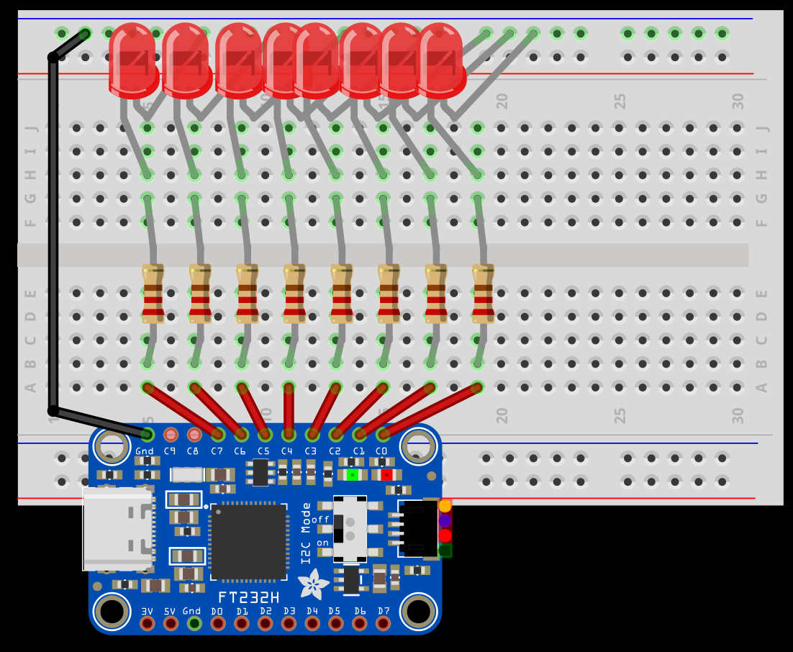
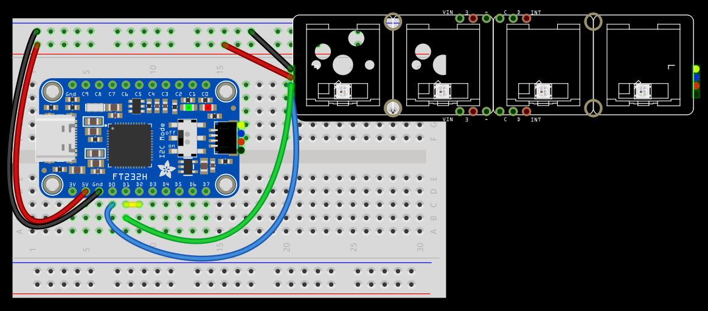

# PsGadget

PsGadget is a .NETFramework PowerShell-based modular gadget framework built around the FT232H chip, bridging the gap between administration and electronic hardware.

This module enables users to interface with common electronic components through PowerShell - to create practical hardware tools that extend their capabilities beyond the standard workstation setup.

With PsGadget, admins can build custom monitoring displays, environmental sensors, physical notification systems, or automation controls using readily available hobbyist components, all programmed through familiar PowerShell commandlet -- turning ideas into tangible hardware solutions that make daily sysadmin work more interesting and fun.


## Potential Hardware Configurations:

### PsGadget_Display (see: intro image)
Configuration for an I2C LED display (e.g. SSD1306 128×64)


### PsGadget_LED
Flash, blink, or fade an single LED or a group of LEDs (e.g. WS2812B) with RGB color mixing



### PsGadget_NeoPixel
Pair with an Adafruit NeoDriver and control addressable NeoPixels (e.g. WS2812B) with RGB color mixing


### PSGadget_Button

Connect to a button array like the NeoKey where each button can trigger a different event or invoke a script.



### Other Potential Configurations

- PsGadget_DCMotor
- PsGadget_Sensor
- PsGadget_Button
- PsGadget_Buzzer
- PsGadget_UART
- PsGadget_I2C
- PsGadget_SPI

## PsGadget_ESP32  

Paired with an ESP32 board running your pre‑flashed MicroPython firmware, this configuration lets PsGadget issue high‐level commands over serial to tap into the ESP32’s rich feature set:


- **PortName** – e.g. `COM3` on Windows or `/dev/ttyUSB0` on Linux  
- **BaudRate** – e.g. `115200`  
- **ResetPin**, **BootPin** – FT232H ACBUS pins used to drive the ESP32’s EN and IO0 lines for hardware reset or entering the bootloader  
- **CommandTimeout**, **RetryCount** – serial‐transaction settings  

#### Networking  
- **WiFiMode** – `"Station"`, `"AP"`, or `"Station+AP"`  
- **SSID**, **Password** – credentials for STA or AP  
- **IPConfig** – static IP or DHCP  

#### ESP‑Now  
- **ESPNowPeers** – array of peer MAC addresses to which you’ll send/receive data  
- **Channel** – RF channel for ESP‑Now communication  

#### Bluetooth  
- **BluetoothMode** – `"BLE"` or `"Classic"`  
- **GATTServices** – list of service/characteristic UUIDs for BLE interactions  

#### PWM & GPIO  
- **PWMChannels** – hashtable of pin numbers mapped to `{ Frequency, DutyCycle }`  
- **DigitalPins** – list of GPIO pins you can drive or read, with pull‑up/down settings  

#### ADC & DAC  
- **ADCChannels** – list of ADC pin numbers and their attenuation (e.g. `11dB`)  
- **DACChannels** – list of DAC pin numbers for analog outputs  

#### Bus Bridging  
- **I2CBus** – map SDA/SCL pins if you want to proxy an I²C bus through the ESP32  
- **SPIBus** – map SCLK/MOSI/MISO/CS pins for SPI pass‑through  

#### Command Mapping  
- **FirmwareFunctionMap** – maps PsGadget commands to MicroPython RPC calls, e.g.:  
    ```powershell
  @{
    "SetLED"     = "led.on({pin},{r},{g},{b})"
    "ReadTemp"   = "sensor.read_temp()"
    "StartScan"  = "wifi.scan()"
    "SendESPNOW" = "espnow.send({mac},{data})"
  }
    ```

