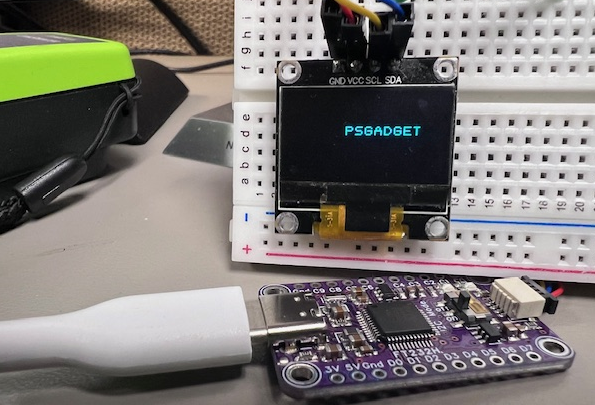
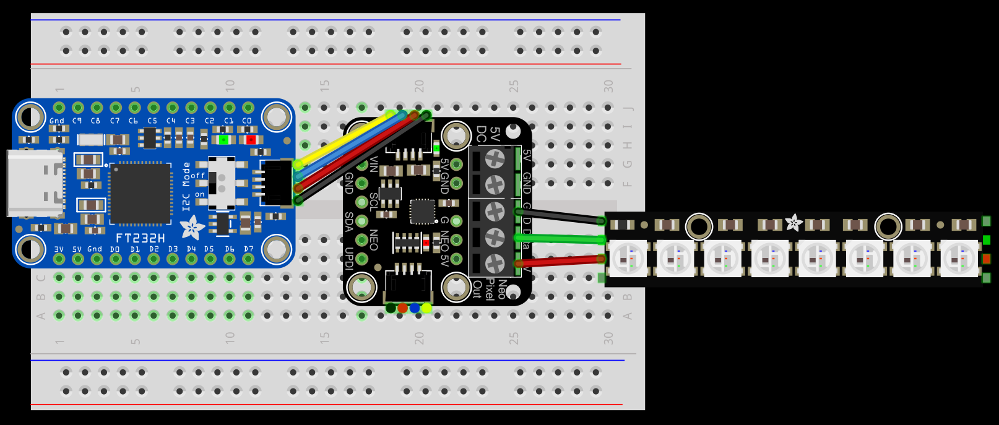
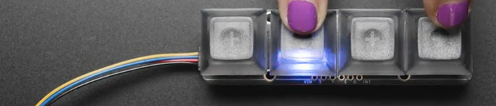
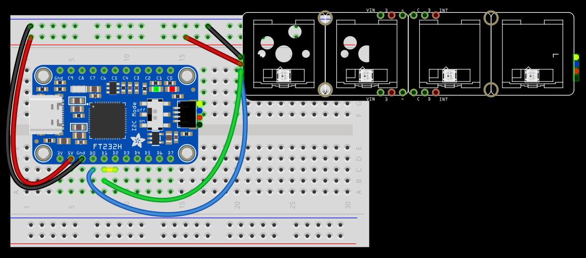
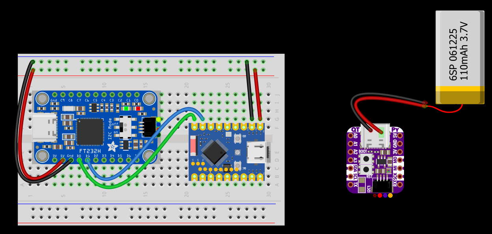
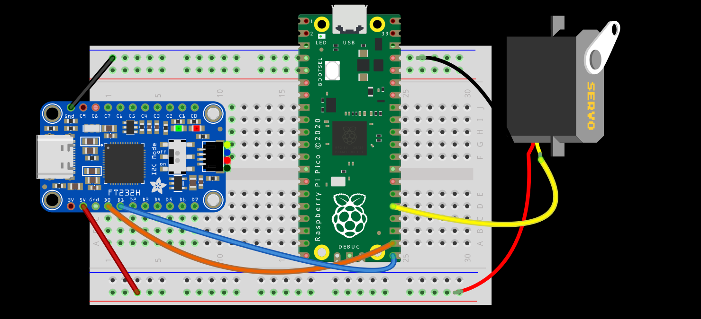

# PsGadget

PsGadget is a .NETFramework PowerShell-based modular gadget framework built around the FT232H chip, bridging the gap between administration and electronic hardware.

This module enables users to interface with common electronic components through PowerShell - to create practical hardware tools that extend their capabilities beyond the standard workstation setup.

With PsGadget, admins can build custom monitoring displays, environmental sensors, physical notification systems, or automation controls using readily available hobbyist components, all programmed through familiar PowerShell commandlets -- turning ideas into tangible hardware solutions that could make daily sysadmin work more interesting and fun.

# Configuration

PsGadget is designed to be modular, allowing users to create custom configurations based on their needs. Each configuration can be tailored to specific hardware components and functionalities, enabling a wide range of applications.

## PsGadget_Display

Use an I2C LED display (e.g. SSD1306 128×64). [Click here for a quickstart guide](docs/psgadget_display.md)

## PsGadget_UART 

The FT232H provides robust UART (Universal Asynchronous Receiver-Transmitter) with configurable baud rates, data formats, and flow control, making it suitable for virtually any serial communication requirement.

## PsGadget_LED

Flash, blink, or fade LEDs to signal events or notifications. This configuration can be used to create visual indicators for system status, alerts, or other events.

## PsGadget_NeoPixel

Pair with an [Adafruit NeoDriver](https://www.adafruit.com/product/5766) and control addressable NeoPixels (e.g. WS2812B) with RGB color mixing

## PSGadget_Button

Connect to a button array like the [Adafruit NeoKey 1x4](https://www.adafruit.com/product/4980). Each button press could be configured to trigger an event, send a command, or perform a specific action. This is useful for creating custom input devices, remote controls, or interactive displays.

## PsGadget_ESP32  

Paired with an ESP32 microcontroller board running pre‑flashed MicroPython code, this configuration lets PsGadget issue high‐level commands over UART to tap into the ESP32’s rich feature set, like ESPNow for peer-to-peer wireless communication, WiFi, Bluetooth, and GPIO control with PWM to easily drive motors, servos, and sensors.

## PsGadget_Pico

If wireless connectivity is not a strict requirement, then the Raspberry Pi Pico is a great alternative. It has a similar feature set to the ESP32, but less expensive, making it a cost-effective option for many projects. With pre-flashed code, PsGadget can issue high-level predefined commands over UART to the Pico, allowing you to tap into its rich feature set, including GPIO control with PWM to easily drive motors, servos, and sensors.

## Other Potential Configurations

- PsGadget_DCMotor - drive DC motors
- PsGadget_Servo - drive servo motors
- PsGadget_Stepper - drive stepper motors
- PsGadget_Sensor - get data from sensors
- PsGadget_Audio - control audio output