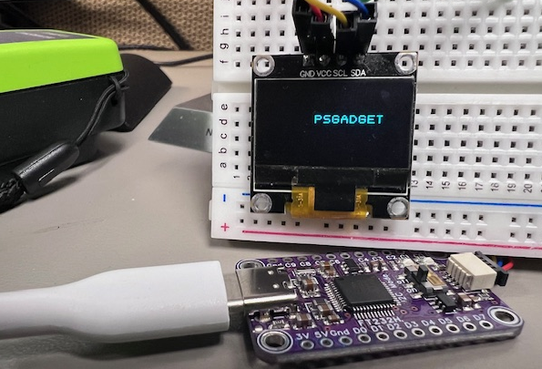
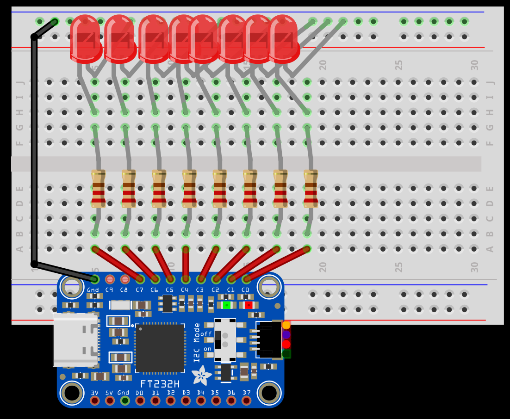
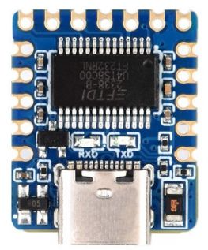
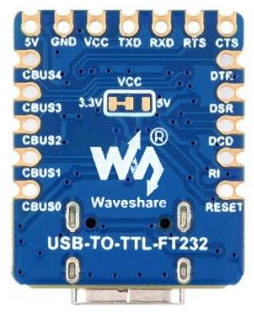

# PSGadget PowerShell Module

Control LEDs, drive an OLED screen, and talk to microcontrollers -- all from a
standard PowerShell session. No Arduino IDE. No C. Just cmdlets.

**Version**: 0.3.3  |  **PowerShell**: 5.1+  |  **Platforms**: Windows, Linux, macOS

---

## What can I do with this?



A few things you can do from a PowerShell prompt after plugging in a ~$10 USB adapter:

- Write live text to a 128x64 OLED screen (`Write-PsGadgetSsd1306`)
- Toggle GPIO pins HIGH/LOW to blink LEDs or trigger relays (`Set-PsGadgetGpio`)
- Execute code on a Raspberry Pi Pico or ESP32 over serial REPL (`Connect-PsGadgetMpy`)



**New to hardware?** You can import and explore the module right now without
buying anything -- it runs in stub mode and returns simulated data. Run
`Test-PsGadgetEnvironment` when your hardware arrives to confirm everything is wired up.

**Know PowerShell but not the hardware?** An FTDI chip is a small USB-to-GPIO
bridge (~$10 breakout board on Amazon, search "FT232H breakout"). Plug it into
USB and PSGadget lets you toggle its I/O pins, communicate over I2C, or talk
serial -- all from a script, no driver code needed.

**Know electronics but not PowerShell modules?** PSGadget wraps the FTDI D2XX
library in typed cmdlets. Drive strength, I2C via MPSSE, CBUS bit-bang, and
EEPROM programming are all accessible -- see [Supported Hardware](#supported-hardware)
for pin counts, I/O voltage, and mechanism details.

---

## Documentation

| Page | Contents |
|------|----------|
| [Installation Guide](docs/INSTALL.md) | OS-specific install steps, driver setup, persona guides, quick reference |
| [Quick Start](docs/QUICKSTART.md) | Minimal happy path for every device type and all four personas |
| [Architecture](docs/ARCHITECTURE.md) | Layer breakdown, file map, module load order, design rules |
| [Troubleshooting](docs/TROUBLESHOOTING.md) | Symptom index with step-by-step fixes |
| [Personas](docs/PERSONAS.md) | Who each persona is and where to find their content |
| [Platforms](docs/PLATFORMS.md) | OS-specific requirements, capability matrix, known limitations |
| [Cmdlet Reference](docs/REFERENCE/Cmdlets.md) | Every exported function with parameters and return values |
| [Class Reference](docs/REFERENCE/Classes.md) | PsGadgetFtdi, PsGadgetSsd1306, PsGadgetMpy, PsGadgetLogger |
| [Getting Started](docs/wiki/Getting-Started.md) | Prerequisites, installation, first device connection |
| [Function Reference](docs/wiki/Function-Reference.md) | Every exported function with parameters and examples |
| [Configuration](docs/wiki/Configuration.md) | User config file, keys, and defaults |
| [Workflow Reference](examples/psgadget_workflow.md) | Device-by-device workflows: FT232H, FT232R, SSD1306 |
| [Config Detail](docs/about_PsGadgetConfig.md) | Full `config.json` key reference |

---

## Supported Hardware

| Device | GPIO pins | I/O voltage | Mechanism | Where to get one |
|--------|-----------|-------------|-----------|------------------|
| FT232H | ACBUS0-7 (8 pins) | 3.3 V | MPSSE -- SPI, I2C, JTAG, bit-bang | Adafruit #2264, CJMCU breakout, ~$10-15 |
| FT232R / FT232RNL | CBUS0-3 (4 pins) | 3.3 V, drive strength 4 mA (default) / 8 mA | CBUS bit-bang (one-time EEPROM setup required) | SparkFun, CJMCU, ~$5-10 |
| SSD1306 OLED | via FT232H I2C (ACBUS0=SCL, ACBUS1=SDA) | 3.3 V | PsGadgetSsd1306 class | 128x64, 8 pages; Adafruit #326 or generic, ~$5 |
| MicroPython boards | via serial REPL | -- | mpremote over USB-serial | Raspberry Pi Pico (~$4), ESP32-S3 Zero (~$5) |




---

## Quick Start

```powershell
# 1. Import the module
Import-Module ./PSGadget.psd1

# 2. Check environment and connected hardware
#    (-Verbose shows per-device next-step commands you can paste directly)
Test-PsGadgetEnvironment -Verbose

# 3. List connected FTDI devices (FTDI = USB-to-GPIO bridge chip)
List-PsGadgetFtdi | Format-Table

# 4a. FT232H - GPIO immediately available on ACBUS0-7 (3.3V, pin 0 = ACBUS0)
Set-PsGadgetGpio -DeviceIndex 0 -Pins @(0, 1) -State HIGH

# 4b. FT232R - program EEPROM once (then replug), then use CBUS GPIO
Set-PsGadgetFt232rCbusMode -Index 0          # one-time per device
# (replug USB cable, then:)
Set-PsGadgetGpio -DeviceIndex 0 -Pins @(0) -State HIGH

# 5. SSD1306 OLED over FT232H I2C (ACBUS0=SCL, ACBUS1=SDA)
$ftdi    = Connect-PsGadgetFtdi -Index 0
$display = Connect-PsGadgetSsd1306 -FtdiDevice $ftdi
Write-PsGadgetSsd1306 -Display $display -Text "Hello World" -Page 0
$ftdi.Close()

# 6. MicroPython REPL
$mpy = Connect-PsGadgetMpy -SerialPort "/dev/ttyUSB0"
$mpy.Invoke("print('hello from MicroPython')")
```

---

## OOP Interface (recommended for scripts)

`New-PsGadgetFtdi` returns a `PsGadgetFtdi` object whose methods own the
connection lifecycle. This is the cleanest pattern for multi-step scripts.

```powershell
#initialize with serial number (stable across USB ports)
$dev = New-PsGadgetFtdi -SerialNumber "BG01X3GX" 

# Set pin 0 High
$dev.SetPin(0, "HIGH")           

# Set multiple pins, cbus0 and cbus1, High at once
$dev.SetPins(@(0, 1), "HIGH")

# Pulse pin cbus0 Low for 500ms
$dev.PulsePin(0, "HIGH", 500)    

# Clean up and close device connection
$dev.Close()
```

## Exported Functions

| Function | Description |
|----------|-------------|
| `New-PsGadgetFtdi` | Create a `PsGadgetFtdi` object (-SerialNumber / -Index / -LocationId) |
| `Test-PsGadgetEnvironment` | Verify environment, FTDI driver state, and hardware readiness |
| `List-PsGadgetFtdi` | Enumerate all connected FTDI devices |
| `Connect-PsGadgetFtdi` | Open a raw device connection |
| `Get-PsGadgetFtdiEeprom` | Read EEPROM contents (FT232R CBUS inspection) |
| `Set-PsGadgetFt232rCbusMode` | Program FT232R CBUS pins to GPIO mode |
| `Set-PsGadgetFtdiMode` | Set raw FTDI bit-bang or MPSSE mode |
| `Set-PsGadgetGpio` | Set GPIO pin HIGH or LOW (-DeviceIndex / -SerialNumber / -Connection) |
| `Connect-PsGadgetSsd1306` | Initialize SSD1306 OLED over FTDI I2C |
| `Clear-PsGadgetSsd1306` | Clear full display or single page |
| `Write-PsGadgetSsd1306` | Write text with alignment and font size options |
| `Set-PsGadgetSsd1306Cursor` | Set raw column/page cursor position |
| `List-PsGadgetMpy` | Enumerate available MicroPython serial ports |
| `Connect-PsGadgetMpy` | Open a MicroPython REPL connection |
| `Get-PsGadgetConfig` | Read current user configuration |
| `Set-PsGadgetConfig` | Update and persist a configuration value |

See [Function Reference](docs/wiki/Function-Reference.md) for full parameter tables.

---

## Verbose Output

All functions emit `Write-Verbose` messages for diagnostics. Use the `-Verbose`
switch on any command, or set `$VerbosePreference` for the entire session.

| Scope | Syntax | When to use |
|-------|--------|-------------|
| Per-command | `List-PsGadgetFtdi -Verbose` | One-off inspection |
| Full session | `$VerbosePreference = 'Continue'` | Debugging a script |
| Reset session | `$VerbosePreference = 'SilentlyContinue'` | Back to quiet mode |

## Configuration

User preferences live in `~/.psgadget/config.json`, created automatically on
first import. Change settings with `Set-PsGadgetConfig`:

```powershell
# FT232R CBUS drive strength: $false = 4 mA (default), $true = 8 mA
# Increase if you're driving logic inputs with marginal thresholds or longer traces
Set-PsGadgetConfig -Key ftdi.highDriveIOs  -Value $true   

# set default logging level to DEBUG (default INFO)
Set-PsGadgetConfig -Key logging.level      -Value DEBUG

# keep 7 days of logs (default 3)
Set-PsGadgetConfig -Key logging.retainDays -Value 7

# view current config
Get-PsGadgetConfig

# view just the FTDI section
Get-PsGadgetConfig -Section ftdi
```

See [Configuration](docs/wiki/Configuration.md) for all keys and their effects.

## Architecture

```
PSGadget/
|-- PSGadget.psd1              # Module manifest (version, exports)
|-- PSGadget.psm1              # Module loader (strict load order)
|-- Public/                    # Exported functions (one per file)
|-- Private/                   # Internal backends (platform-specific)
|-- Classes/                   # PsGadgetFtdi, PsGadgetMpy, PsGadgetSsd1306, PsGadgetLogger
|-- docs/                      # Reference documentation
|-- examples/                  # Multi-persona walkthrough guides
|-- Tests/                     # Pester tests
|-- lib/                       # FTD2XX_NET.dll (net48 and netstandard20)
```

**Load order** (enforced by PSGadget.psm1):
1. Classes in dependency order: Logger -> Ftdi -> Mpy -> Ssd1306
2. All Private functions
3. All Public functions
4. FTDI assembly initialization (`lib/`)
5. Environment setup (`~/.psgadget/`)

---

## Development

```bash
# Load for development
pwsh -c "Import-Module ./PSGadget.psd1 -Force"

# Run Pester test suite
pwsh -c "Import-Module Pester; Invoke-Pester ./Tests/PsGadget.Tests.ps1 -Output Detailed"

# Smoke test
pwsh -c "Import-Module ./PSGadget.psd1; List-PsGadgetFtdi | Format-Table"
```

The module degrades gracefully to **stub mode** when hardware or drivers are
unavailable -- on any platform. All functions are importable and testable;
hardware calls return stub data rather than throwing unhandled errors.

| Platform | Condition | Mode |
|----------|-----------|------|
| Windows | CDM driver + `FTD2XX_NET.dll` loaded | Full hardware |
| Windows | Driver or DLL missing | Stub (Windows STUB) |
| Linux (.NET 8+) | No hardware | sysfs enumeration + stub connect |
| Linux / macOS (.NET < 8) | Any | Stub |

Run `Test-PsGadgetEnvironment -Verbose` to see exactly which mode is active and why.

---

## Requirements

- PowerShell 5.1 or 7+
- Windows (two components, both required):
  - **FTDI CDM driver package** -- installs native `FTD2XX.dll`: [ftdichip.com/drivers/d2xx-drivers/](https://ftdichip.com/drivers/d2xx-drivers/)
  - **FTD2XX_NET managed wrapper** (v1.3.4, bundled in `lib/`) -- to update: [FTD2XX_NET_v1.3.4.zip](https://ftdichip.com/wp-content/uploads/2026/01/FTD2XX_NET_v1.3.4.zip)
- Linux/macOS: stub mode only (no D2XX driver)
- MicroPython functions: `mpremote` on PATH (`pip install mpremote`)

---

## Contributing

See [.github/copilot-instructions.md](.github/copilot-instructions.md) for AI
agent guidelines and development patterns.