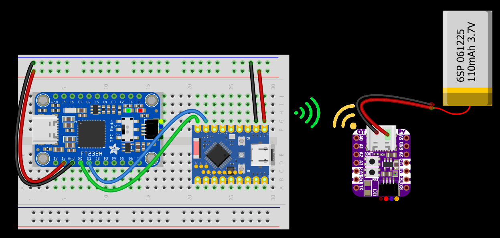

# PsGadget

PsGadget is a .NETFramework PowerShell-based modular gadget framework built around the FT232H chip, bridging the gap between administration and electronic hardware.

This module enables users to interface with common electronic components through PowerShell - to create practical hardware tools that extend their capabilities beyond the standard workstation setup.

With PsGadget, admins can build custom monitoring displays, environmental sensors, physical notification systems, or automation controls using readily available hobbyist components, all programmed through familiar PowerShell commandlets -- turning ideas into tangible hardware solutions that could make daily sysadmin work more interesting and fun.

# Hardware Configurations:

## PsGadget_Display

Use an I2C LED display (e.g. SSD1306 128×64). [Click here for more info](docs/psgadget_display.md)

## PsGadget_UART 

The FT232H provides robust UART (Universal Asynchronous Receiver-Transmitter) functionality, commonly used for:

- Serial debugging - connecting to microcontrollers and development boards to monitor output and send commands.   
- Legacy equipment interfaces - bridging modern USB computers with RS-232/RS-485 devices
- IoT connectivity - enabling serial communication with sensors and wireless modules
- Industrial equipment - providing standardized interfaces to PLCs and control systems

The chip supports configurable baud rates, data formats, and flow control, making it suitable for virtually any serial communication requirement.

## PsGadget_LED
Flash, blink, or fade an single LED or a group of LEDs (e.g. WS2812B) with RGB color mixing

## PsGadget_NeoPixel
Pair with an Adafruit NeoDriver and control addressable NeoPixels (e.g. WS2812B) with RGB color mixing

## PSGadget_Button

Connect to a button array like the [Adafruit NeoKey 1x4](https://www.adafruit.com/product/4980). Each button press could be configured to trigger an event like execute a script.

## PsGadget_ESP32  

Paired with an ESP32 board running your pre‑flashed MicroPython firmware, this configuration lets PsGadget issue high‐level commands over serial to tap into the ESP32’s rich feature set:

## Other Potential Configurations

- PsGadget_DCMotor - drive DC motors
- PsGadget_Servo - drive servo motors
- PsGadget_Stepper - drive stepper motors
- PsGadget_Sensor - get data from sensors
- PsGadget_Audio - control audio output