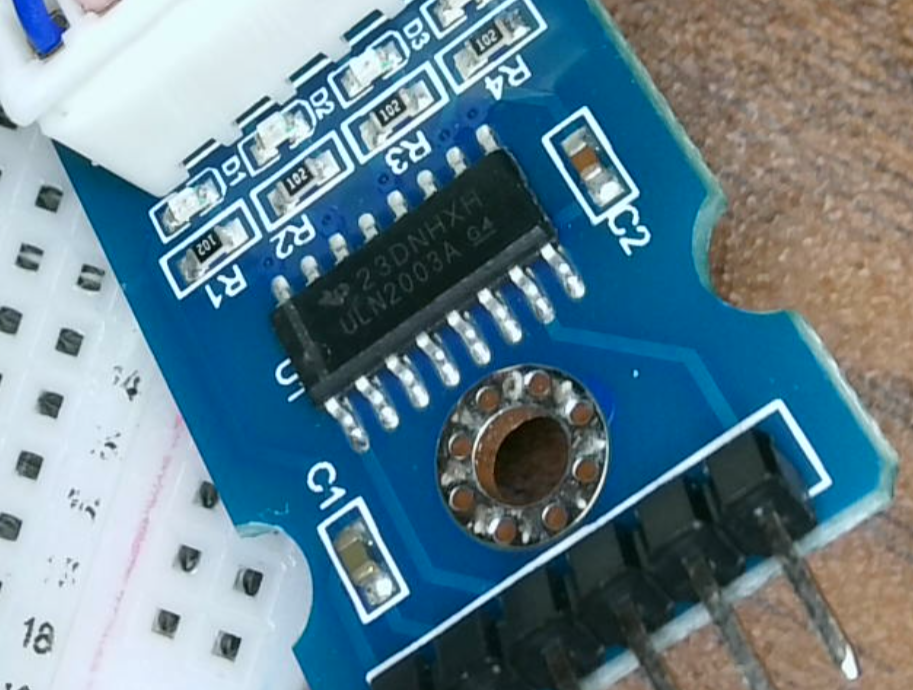
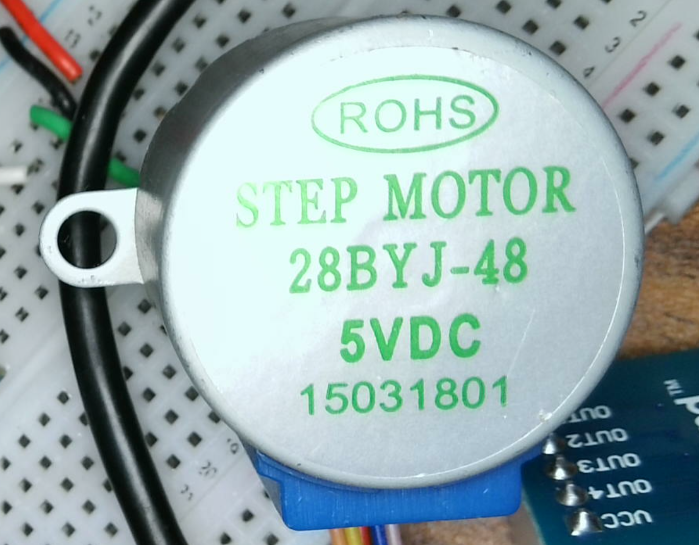

## ULN2003A driver board: 


## Stepper motor


## FTDISharp GPIO

https://github.com/swharden/FtdiSharp/blob/main/src/FtdiSharp/Protocols/GPIO.cs

```Csharp
using FtdiSharp.FTD2XX;
using System.Linq;

namespace FtdiSharp.Protocols;

public class GPIO : ProtocolBase
{
    public GPIO(FtdiDevice device) : base(device)
    {
        FTDI_ConfigureMpsse();
        Write(0b00000000, 0b00000000);
    }

    private void FTDI_ConfigureMpsse()
    {
        FtdiDevice.SetTimeouts(1000, 1000).ThrowIfNotOK();
        FtdiDevice.SetLatency(16).ThrowIfNotOK();
        FtdiDevice.SetFlowControl(FT_FLOW_CONTROL.FT_FLOW_RTS_CTS, 0x00, 0x00).ThrowIfNotOK();
        FtdiDevice.SetBitMode(0x00, 0x00).ThrowIfNotOK(); // RESET
        FtdiDevice.SetBitMode(0x00, 0x02).ThrowIfNotOK(); // MPSSE

        FtdiDevice.FlushBuffer();

        /***** Synchronize the MPSSE interface by sending bad command 0xAA *****/
        FtdiDevice.Write(new byte[] { 0xAA }).ThrowIfNotOK();
        byte[] rx1 = FtdiDevice.ReadBytes(2, out FT_STATUS status1);
        status1.ThrowIfNotOK();
        if ((rx1[0] != 0xFA) || (rx1[1] != 0xAA))
            throw new InvalidOperationException($"bad echo bytes: {rx1[0]} {rx1[1]}");

        /***** Synchronize the MPSSE interface by sending bad command 0xAB *****/
        FtdiDevice.Write(new byte[] { 0xAB }).ThrowIfNotOK();
        byte[] rx2 = FtdiDevice.ReadBytes(2, out FT_STATUS status2);
        status2.ThrowIfNotOK();
        if ((rx2[0] != 0xFA) || (rx2[1] != 0xAB))
            throw new InvalidOperationException($"bad echo bytes: {rx2[0]} {rx2[1]}");

        const uint ClockDivisor = 199; //49 for 200 KHz, 199 for 100 KHz

        int numBytesToSend = 0;
        byte[] buffer = new byte[100];
        buffer[numBytesToSend++] = 0x8A;   // Disable clock divide by 5 for 60Mhz master clock
        buffer[numBytesToSend++] = 0x97;   // Turn off adaptive clocking
        buffer[numBytesToSend++] = 0x8C;   // Enable 3 phase data clock, used by I2C to allow data on both clock edges
                                           // The SK clock frequency can be worked out by below algorithm with divide by 5 set as off
                                           // SK frequency  = 60MHz /((1 +  [(1 +0xValueH*256) OR 0xValueL])*2)
        buffer[numBytesToSend++] = 0x86;   //Command to set clock divisor
        buffer[numBytesToSend++] = (byte)(ClockDivisor & 0x00FF);  //Set 0xValueL of clock divisor
        buffer[numBytesToSend++] = (byte)((ClockDivisor >> 8) & 0x00FF);   //Set 0xValueH of clock divisor
        buffer[numBytesToSend++] = 0x85;           // loopback off

        byte[] msg = buffer.Take(numBytesToSend).ToArray();
        FtdiDevice.Write(msg).ThrowIfNotOK();
    }

    /// <summary>
    /// Bits in each byte represent pins D0-D7.
    /// Setting a direction bit to 1 means output.
    /// Setting a value bit to 1 means high.
    /// </summary>
    public void Write(byte direction, byte value)
    {
        byte[] bytes = new byte[] { 0x80, value, direction };
        for (int i = 0; i < 5; i++)
            FtdiDevice.Write(bytes);
    }

    public byte Read()
    {
        Flush();
        const byte READ_GPIO_LOW = 0x81; // Application Note AN_108 (section 3.6.3) 
        const byte SEND_IMMEDIATE = 0x87; // This will make the chip flush its buffer back to the PC.

        FtdiDevice.Write(new byte[] { READ_GPIO_LOW, SEND_IMMEDIATE });

        byte[] result = { 0 };
        uint numBytesRead = 0;
        FtdiDevice.Read(result, 1, ref numBytesRead).ThrowIfNotOK();

        return result[0];
    }
}
```


## micropython py reference: 
https://github.com/IDWizard/uln2003/blob/master/uln2003.py
```python
import microbit

# (c) IDWizard 2017
# MIT License.

microbit.display.off()

LOW = 0
HIGH = 1
FULL_ROTATION = int(4075.7728395061727 / 8) # http://www.jangeox.be/2013/10/stepper-motor-28byj-48_25.html

HALF_STEP = [
    [LOW, LOW, LOW, HIGH],
    [LOW, LOW, HIGH, HIGH],
    [LOW, LOW, HIGH, LOW],
    [LOW, HIGH, HIGH, LOW],
    [LOW, HIGH, LOW, LOW],
    [HIGH, HIGH, LOW, LOW],
    [HIGH, LOW, LOW, LOW],
    [HIGH, LOW, LOW, HIGH],
]

FULL_STEP = [
 [HIGH, LOW, HIGH, LOW],
 [LOW, HIGH, HIGH, LOW],
 [LOW, HIGH, LOW, HIGH],
 [HIGH, LOW, LOW, HIGH]
]

class Command():
    """Tell a stepper to move X many steps in direction"""
    def __init__(self, stepper, steps, direction=1):
        self.stepper = stepper
        self.steps = steps
        self.direction = direction

class Driver():
    """Drive a set of motors, each with their own commands"""

    @staticmethod
    def run(commands):
        """Takes a list of commands and interleaves their step calls"""
        
        # Work out total steps to take
        max_steps = sum([c.steps for c in commands])

        count = 0
        while count != max_steps:
            for command in commands:
                # we want to interleave the commands
                if command.steps > 0:
                    command.stepper.step(1, command.direction)
                    command.steps -= 1
                    count += 1
        
class Stepper():
    def __init__(self, mode, pin1, pin2, pin3, pin4, delay=2):
        self.mode = mode
        self.pin1 = pin1
        self.pin2 = pin2
        self.pin3 = pin3
        self.pin4 = pin4
        self.delay = delay  # Recommend 10+ for FULL_STEP, 1 is OK for HALF_STEP
        
        # Initialize all to 0
        self.reset()
        
    def step(self, count, direction=1):
        """Rotate count steps. direction = -1 means backwards"""
        for x in range(count):
            for bit in self.mode[::direction]:
                self.pin1.write_digital(bit[0]) 
                self.pin2.write_digital(bit[1]) 
                self.pin3.write_digital(bit[2]) 
                self.pin4.write_digital(bit[3]) 
                microbit.sleep(self.delay)
        self.reset()
        
    def reset(self):
        # Reset to 0, no holding, these are geared, you can't move them
        self.pin1.write_digital(0) 
        self.pin2.write_digital(0) 
        self.pin3.write_digital(0) 
        self.pin4.write_digital(0) 

if __name__ == '__main__':

    s1 = Stepper(HALF_STEP, microbit.pin16, microbit.pin15, microbit.pin14, microbit.pin13, delay=5)    
    s2 = Stepper(HALF_STEP, microbit.pin6, microbit.pin5, microbit.pin4, microbit.pin3, delay=5)   
    #s1.step(FULL_ROTATION)
    #s2.step(FULL_ROTATION)

    runner = Driver()
    runner.run([Command(s1, FULL_ROTATION, 1), Command(s2, FULL_ROTATION/2, -1)])
```