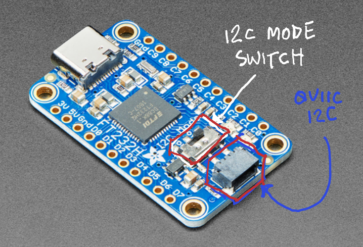

# Example: SSD1306 OLED Display via FT232H I2C

Drive a 128x64 or 128x32 SSD1306 OLED display from a Windows PC using an FT232H USB adapter.
PSGadget uses the FTD2XX_NET managed wrapper (`lib/net48/FTD2XX_NET.dll`) and drives
the FT232H MPSSE engine directly via the D2XX API.

---

## Table of Contents

- [Who This Is For](#who-this-is-for)
- [What You Need](#what-you-need)
- [Hardware Background](#hardware-background)
  - [I2C address](#i2c-address)
  - [128x32 vs 128x64](#128x32-vs-128x64)
- [Hardware Wiring](#hardware-wiring)
  - [I2C Mode Switch](#i2c-mode-switch)
- [Step 1 - Load the Module and Verify Detection](#step-1---load-the-module-and-verify-detection)
- [Step 2 - Connect the Device](#step-2---connect-the-device)
- [Step 3 - Visual Initialization Check (ShowSplash)](#step-3---visual-initialization-check-showsplash)
- [Step 4 - Scan the I2C Bus](#step-4---scan-the-i2c-bus)
- [Step 5 - Write to the Display](#step-5---write-to-the-display)
  - [Simple text](#simple-text)
  - [Advanced formatting](#advanced-formatting)
- [Step 6 - Clear the Display](#step-6---clear-the-display)
- [Step 7 - Write Text](#step-7---write-text)
  - [Display layout reference](#display-layout-reference)
  - [Text alignment](#text-alignment)
  - [Large text (FontSize 2 — double width and double height)](#large-text-fontsize-2--double-width-and-double-height)
  - [Inverted text (dark on white)](#inverted-text-dark-on-white)
- [Step 8 - Live Clock Example](#step-8---live-clock-example)
- [Step 9 - Scrolling Status Display](#step-9---scrolling-status-display)
- [Step 10 - Close the Connection](#step-10---close-the-connection)
- [Using Invoke-PsGadgetI2C (Preferred Public API)](#using-invoke-psgadgeti2c-preferred-public-api)
  - [Symbols Reference](#symbols-reference)
- [Complete Examples](#complete-examples)
  - [Example 1 - Standard (quiet output)](#example-1---standard-quiet-output)
  - [Example 2 - Verbose (beginner-friendly)](#example-2---verbose-beginner-friendly)
- [Troubleshooting](#troubleshooting)
  - [Display stays blank after init](#display-stays-blank-after-init)
  - [ShowSplash returns False / WARNING](#showsplash-returns-false--warning)
  - [Failed to open device](#failed-to-open-device)
  - [Device appears as COM port (VCP mode)](#device-appears-as-com-port-vcp-mode)
  - [ScanI2CBus returns nothing](#scani2cbus-returns-nothing)
  - [Display shows scattered or random pixels](#display-shows-scattered-or-random-pixels)
  - [Display shows correct content on one half only](#display-shows-correct-content-on-one-half-only)
  - [Partial or garbled text](#partial-or-garbled-text)
  - [NACK error on I2C write](#nack-error-on-i2c-write)
  - [MPSSE sync failed error](#mpsse-sync-failed-error)
  - [Session cleanup — device busy on reconnect](#session-cleanup--device-busy-on-reconnect)
- [Quick Reference (Pro)](#quick-reference-pro)

---

## Who This Is For

- **Beginner** — new to electronics, I2C, and PowerShell
- **Scripter** — comfortable with PowerShell, new to hardware buses and FTDI
- **Engineer** — familiar with I2C and electronics, less familiar with the Windows driver
  stack and PowerShell module system
- **Pro** — experienced with both; skip to the Quick Reference at the bottom

---

## What You Need

- An FT232H USB adapter (any breakout; must have MPSSE — verify with `HasMpsse = True`)
- An SSD1306 128x64 or 128x32 I2C OLED module (0.96" / 1.3" / 0.91", common on Amazon / eBay)
- 4 jumper wires
- Windows PC with FTDI CDM drivers installed, USB cable
- PowerShell 5.1 or 7.x
- PSGadget module cloned locally

> **Beginner**: The FT232H is a USB adapter chip that speaks multiple hardware protocols.
> The SSD1306 is the driver chip inside a small black OLED screen — the same kind seen
> on Arduino starter kits. Instead of an Arduino, we connect it directly to the PC's USB
> port through the FT232H.

---

## Hardware Background

> **Engineer**: The FT232H includes the MPSSE (Multi-Protocol Synchronous Serial Engine),
> a hardware block that implements I2C, SPI, and JTAG. PSGadget drives MPSSE I2C directly
> via the FTD2XX_NET managed D2XX wrapper (`FTD2XX_NET.dll`). ADBUS0 is SCL and ADBUS1 is
> SDA at 100 kHz standard mode with 3-phase data clocking enabled.
>
> The SSD1306 uses HORIZONTAL addressing mode (0x20, 0x00). Page writes use SET_COL_ADDR
> (0x21) and SET_PAGE_ADDR (0x22) window commands. The init sequence and all command writes
> are sent as batched I2C transactions (0x00 control byte + all command bytes in one transfer).
> Data writes use 0x40 control byte. The 9th ACK clock pulse is generated manually in the
> MPSSE TX buffer after each data byte — without it the SSD1306's I2C state machine
> misaligns all subsequent bytes by 1 bit.

### I2C address

| ADDR pin state | I2C address |
|---|---|
| Pulled LOW (default on most modules) | 0x3C |
| Pulled HIGH | 0x3D |

Check your module's datasheet or silkscreen. Most cheap 0.96" modules are fixed at 0x3C.

### 128x32 vs 128x64

**Always specify the correct display height.** If you initialize a 128x32 display with the
default 128x64 settings the mux ratio and COM pin configuration will be wrong, producing
scattered or corrupted pixels.

```powershell
# 128x64 (default — no flag needed)
$dev = New-PsGadgetFtdi -Index 0

# 128x32 — must specify height
$dev = New-PsGadgetFtdi -Index 0 -DisplayHeight 32
```

| Height | Mux ratio | COM pins byte | Pages |
|---|---|---|---|
| 64 px (default) | 0x3F (63) | 0x12 (alt, L/R remap) | 8 |
| 32 px | 0x1F (31) | 0x02 (sequential) | 4 |

> **Beginner**: If your screen looks like it has random dots instead of what you wrote,
> the most likely cause is a height mismatch. Add `-DisplayHeight 32` to your
> `New-PsGadgetFtdi` call if your display is the short (0.91") kind.

---

## Hardware Wiring

Connect four wires between the FT232H breakout and the SSD1306 module:

| FT232H pin | MPSSE function | SSD1306 pin |
|---|---|---|
| ADBUS0 (D0) | SCK / SCL | SCL |
| ADBUS1 (D1) | DO / SDA  | SDA |
| 3.3V        | Power     | VCC |
| GND         | Ground    | GND |

> **Beginner**: Look for pin labels printed on your FT232H board. D0 and D1 are usually
> the first two signal pins in a row. The SSD1306 has 4 pins labeled SCL, SDA, VCC, GND
> (sometimes in a different order — check the silkscreen).

> **Engineer**: The FT232H I/O is 3.3V logic. Most SSD1306 modules accept 3.3V.
> MPSSE drives SCL/SDA as push-pull with open-drain emulation (drive-zero mode, 0x9E).
> Keep wires under 20 cm to avoid capacitance problems at 100 kHz.

### I2C Mode Switch

Some FT232H breakout boards (e.g. Adafruit FT232H) have a physical mode switch labeled
**I2C Mode** (or similar). This switch must be in the **ON** position for I2C to work.



If the switch is in the wrong position the MPSSE will still initialize successfully,
but the SDA line will not be connected and `ScanI2CBus()` will return no devices.

---

## Step 1 - Load the Module and Verify Detection

```powershell
Import-Module C:\path\to\PSGadget\PSGadget.psd1 -Force -DisableNameChecking

Get-PsGadgetFtdi | Format-Table Index, Type, SerialNumber, LocationId, HasMpsse
```

Expected output:

```
Index  Type    SerialNumber  LocationId  HasMpsse
-----  ----    ------------  ----------  --------
  0    FT232H  FT4ABCDE      197634      True
```

You need a row with `HasMpsse = True`. If you see `FT232R` with `HasMpsse = False`, that
device cannot drive the SSD1306 — you need an FT232H.

> **Beginner**: "HasMpsse" means the chip has the special hardware inside that speaks I2C.
> The FT232H has it. The FT232R does not. Make sure your adapter's Type column shows FT232H.

---

## Step 2 - Connect the Device

```powershell
# 128x64 display (default)
$dev = New-PsGadgetFtdi -Index 0

# 128x32 display — specify height
$dev = New-PsGadgetFtdi -Index 0 -DisplayHeight 32

if (-not $dev.IsOpen) {
    Write-Error "Failed to open device. Check USB and index."
    return
}

Write-Host ("Connected: {0} [{1}]" -f $dev.Description, $dev.Type)
```

`New-PsGadgetFtdi` follows the MicroPython convention: construction implies connection.
The device is open and ready to use on the line immediately after.

> **Scripter**: In long-running scripts, prefer `-SerialNumber` or `-LocationId` over
> `-Index` so the reference stays stable when the USB hub order changes:
>
> ```powershell
> $dev = New-PsGadgetFtdi -SerialNumber "FT4ABCDE"   # stable across hub reorder
> $dev = New-PsGadgetFtdi -LocationId 197634          # stable for fixed physical port
> ```

---

## Step 3 - Visual Initialization Check (ShowSplash)

`ShowSplash()` is the recommended way to confirm the display hardware is alive and the full
I2C pipeline is working before your application starts writing content.

```powershell
$d = $dev.GetDisplay()
$d.Initialize($false)
$d.ShowSplash()
```

What you should see:

- A solid **2-pixel border** drawn around the entire display edge
- **"PsGadget"** rendered in the center at **FontSize 2** (double width + double height)
- The display holds for **3 seconds**, then clears automatically

If you see the border and text, the following are all confirmed working:

- I2C addressing is correct
- MPSSE initialization succeeded
- GDDRAM writes are reaching the controller
- The framebuffer → `FlushAll()` pipeline is healthy

> **Engineer**: `ShowSplash()` renders the border and text into the framebuffer in memory
> (via `SetLogicalPixel()`), then issues a single `FlushAll()` call — one bulk I2C write.
> It does **not** call `WriteText()` internally, which would clear the pages it touches.
> FontSize 2 = 2× width (each glyph column repeated twice) + 2× height (`ExpandNibble`),
> giving 12×16 pixels per character — identical behavior on 128×32 and 128×64.

---

## Step 4 - Scan the I2C Bus

Before or after `ShowSplash`, confirm the device address with `ScanI2CBus()`:

```powershell
$dev.ScanI2CBus() | Format-Table

# Expected:
# Address  Hex
# -------  ---
#      60  0x3C
```

> **Scripter**: `ScanI2CBus()` probes addresses 0x08 through 0x77. If nothing appears,
> check your VCC/GND wires first, then SCL/SDA. If you see 0x3D instead of 0x3C, pass
> `-Address 0x3D` in subsequent calls.

> **Engineer**: `ScanI2CBus()` calls `Invoke-FtdiI2CScan` which probes each address via
> raw MPSSE I2C transactions over FTD2XX_NET. Each probe issues START, clocks out the address
> byte (R/W=1), reads back 1 ACK bit, then issues STOP. ACK bit=0 means device present.
> No read data is transferred.

---

> **Note**: `Write-PsGadgetSsd1306`, `Clear-PsGadgetSsd1306`, and `Set-PsGadgetSsd1306Cursor`
> were removed in v0.3.7. Use `$d.WriteText()`, `$d.Clear()`, `$d.ClearPage()` on the object
> returned by `$dev.GetDisplay()`, or use `Invoke-PsGadgetI2C -I2CModule SSD1306`.

---

## Step 5 - Write to the Display

Two paths, pick based on what you need:

| Need | Use |
|---|---|
| Simple text (one line) | `$dev.Display("text", page)` |
| Full control (align, font, symbols, clear) | `$d = $dev.GetDisplay()` then `$d.WriteText(...)` |

### Simple text

```powershell
$dev.Display("Hello World")          # page 0, address 0x3C
$dev.Display("PS Summit 2026!", 2)   # page 2
$dev.Display("Alt addr", 0, 0x3D)    # different I2C address
```

The display is initialized on the first call and reused on all subsequent calls.

### Advanced formatting

`GetDisplay()` returns the cached display object (initializing it on first call).
Use it when you need alignment, larger text, or inverted rows:

```powershell
$d = $dev.GetDisplay()               # init once, reuse every call
$d.WriteText("PSGadget", 0, 'center', 1, $false)
$d.WriteText("12:34:56", 2, 'center', 2, $false)   # FontSize 2 = double width + double height
$d.WriteText("ALARM",    6, 'center', 1, $true)    # $true = inverted
```

> **Beginner**: `$dev.GetDisplay()` gives you a handle to the screen. Think of it like
> opening a file before you can write formatted content into it. `$dev.Display()` is the
> shortcut that does everything in one step but without formatting options.

> **Engineer**: `GetDisplay()` returns `$dev._display` (a `PsGadgetSsd1306` instance wired
> to the ADBUS MPSSE I2C path via the cached D2XX connection). Both `Display()` and
> `ClearDisplay()` call `GetDisplay()` internally — only one I2C handle exists per device.

---

## Step 6 - Clear the Display

Always clear before writing new content to avoid leftover pixels.

```powershell
$dev.ClearDisplay()      # clear all pages
$dev.ClearDisplay(3)     # clear only page 3 (faster for live updates)
```

If you already have `$d` from `GetDisplay()`:

```powershell
$d.Clear()        # clear all pages
$d.ClearPage(3)   # clear one page
```

Both operate on the same cached object.

> **Engineer**: The SSD1306 128x64 GDDRAM is organized as 8 horizontal pages (rows),
> each 8 pixels tall and 128 bytes wide. One byte per column, one bit per pixel row
> (bit 0 = top pixel of the page). `.Clear()` / `.ClearPage()` zero the framebuffer
> bytes and call `FlushAll()` / `Write-Ssd1306Page()` respectively.

---

## Step 7 - Write Text

### Display layout reference

| Page | Pixel rows | Approx use |
|---|---|---|
| 0 | 0 – 7   | Header / title |
| 1 | 8 – 15  | Status line 1 |
| 2 | 16 – 23 | Status line 2 |
| 3 | 24 – 31 | Status line 3 |
| 4 | 32 – 39 | Status line 4 |
| 5 | 40 – 47 | Status line 5 |
| 6 | 48 – 55 | Status line 6 |
| 7 | 56 – 63 | Footer |

The built-in font is 6×8 pixels per character (FontSize 1), giving up to ~21 characters per row.

```powershell
$d = $dev.GetDisplay()
$dev.ClearDisplay()
$d.WriteText("PSGadget",                              0, 'center', 1, $false)
$d.WriteText("Hello World",                           1, 'left',   1, $false)
$d.WriteText("Date: " + (Get-Date -f "yyyy-MM-dd"),  3, 'left',   1, $false)
```

> **Beginner**: The second argument is which row of the screen to write on. Page 0 is the
> top row, page 7 is the bottom. `'center'` centers the text horizontally.

### Text alignment

```powershell
$d = $dev.GetDisplay()
$dev.ClearDisplay()
$d.WriteText("left",   1, 'left',   1, $false)
$d.WriteText("center", 3, 'center', 1, $false)
$d.WriteText("right",  5, 'right',  1, $false)
```

### Large text (FontSize 2 — double width and double height)

FontSize 2 is a true 2× scale in **both** dimensions:

| | FontSize 1 | FontSize 2 |
|---|---|---|
| Glyph width  | 6 px per column  | 12 px per column (each column repeated twice) |
| Glyph height | 8 px (1 page)    | 16 px (2 pages, via ExpandNibble row doubling) |
| Chars per row | ~21             | ~10 |

FontSize 2 is display-size independent — it renders at 12×16 on both 128×32 and 128×64.
When using FontSize 2, the text occupies pages N **and** N+1. Choose a page in 0–6 so
the second page (N+1) fits on screen.

```powershell
# Renders at pages 0 and 1 (16 px tall total)
$d.WriteText("14:23", 0, 'center', 2, $false)
```

> **Engineer**: FontSize 2 is implemented in `WriteTextTall()`. Each 8-bit glyph column
> byte is split into low nibble (top 4 pixel rows) and high nibble (bottom 4 pixel rows).
> `ExpandNibble()` doubles each bit in a nibble to produce an 8-bit expanded byte, giving
> 2 rows per original row. Width doubling repeats each expanded column byte twice.

### Inverted text (dark on white)

`-Invert` flips all pixel values before sending so text appears as dark characters on a
white background.

```powershell
$d.WriteText("ALARM", 4, 'center', 1, $true)
```

> **Engineer**: Inversion is applied in software per-write via XOR 0xFF. The SSD1306
> hardware inversion command (0xA7) inverts the entire display; PSGadget's invert is
> per-row, allowing mixed normal and inverted rows simultaneously.

---

## Step 8 - Live Clock Example

```powershell
$d = $dev.GetDisplay()
$dev.ClearDisplay()
$d.WriteText("Live Clock", 0, 'center', 1, $false)

$deadline = (Get-Date).AddSeconds(10)
while ((Get-Date) -lt $deadline) {
    $dev.ClearDisplay(3)
    $d.WriteText((Get-Date -Format "HH:mm:ss"), 3, 'center', 2, $false)
    Start-Sleep -Milliseconds 500
}
```

> **Scripter**: Update twice per second (500ms) to stay current. A full `ClearDisplay` +
> `WriteText` round-trip over I2C takes ~300–500 ms, so `Start-Sleep -Seconds 1` will
> visibly skip every other second.

---

## Step 9 - Scrolling Status Display

```powershell
$d = $dev.GetDisplay()
$dev.ClearDisplay()
$d.WriteText("-- STATUS --", 0, 'center', 1, $false)

$lines = @(
    ("CPU: {0}%" -f (Get-WmiObject Win32_Processor | Select-Object -Expand LoadPercentage)),
    ("MEM: {0}MB free" -f [Math]::Round((Get-WmiObject Win32_OS).FreePhysicalMemory / 1024)),
    ("Time: " + (Get-Date -Format "HH:mm:ss"))
)

for ($i = 0; $i -lt $lines.Count; $i++) {
    $d.WriteText($lines[$i], $i + 2, 'left', 1, $false)
}
```

> **Pro**: SSD1306 hardware scrolling commands (continuous scroll, diagonal scroll) are
> not yet implemented in PSGadget. Implement via direct MPSSE write if needed.

---

## Step 10 - Close the Connection

Always release the D2XX handle when done:

```powershell
$dev.Close()
Write-Host "Device closed."
```

> **Beginner**: The `.Close()` call tells Windows to release the USB device so other
> programs can use it. If you forget and try to reconnect you may get a "device busy" error.

---

## Using Invoke-PsGadgetI2C (Preferred Public API)

`Invoke-PsGadgetI2C -I2CModule SSD1306` is the recommended public interface for scripts.
It auto-initializes the display on first use and caches the device.

```powershell
$ftdi = New-PsGadgetFtdi -Index 0

# Clear entire display
Invoke-PsGadgetI2C -PsGadget $ftdi -I2CModule SSD1306 -Clear

# Clear a single page
Invoke-PsGadgetI2C -PsGadget $ftdi -I2CModule SSD1306 -Clear -Page 3

# Single-row text (FontSize 1 — 6x8, ~21 chars wide)
Invoke-PsGadgetI2C -PsGadget $ftdi -I2CModule SSD1306 -Text "Hello World" -Page 0
Invoke-PsGadgetI2C -PsGadget $ftdi -I2CModule SSD1306 -Text "Centered"    -Page 2 -Align center
Invoke-PsGadgetI2C -PsGadget $ftdi -I2CModule SSD1306 -Text "Right"       -Page 4 -Align right

# Double-size text (FontSize 2 — 12x16, spans pages N and N+1)
Invoke-PsGadgetI2C -PsGadget $ftdi -I2CModule SSD1306 -Text "14:23" -Page 0 -FontSize 2 -Align center

# Inverted text
Invoke-PsGadgetI2C -PsGadget $ftdi -I2CModule SSD1306 -Text "ALARM" -Page 6 -Align center -Invert

# Draw a sysadmin symbol
# page <= 6: renders 16x16 (2 pages tall), page 7: renders 8x8 (1 page)
Invoke-PsGadgetI2C -PsGadget $ftdi -I2CModule SSD1306 -Symbol Warning   -Page 0
Invoke-PsGadgetI2C -PsGadget $ftdi -I2CModule SSD1306 -Symbol Checkmark -Page 2 -Column 56
Invoke-PsGadgetI2C -PsGadget $ftdi -I2CModule SSD1306 -Symbol Error     -Page 7

# Non-default address (ADDR pin pulled high -> 0x3D)
Invoke-PsGadgetI2C -PsGadget $ftdi -I2CModule SSD1306 -I2CAddress 0x3D -Text "Alt" -Page 0

# Without -PsGadget: device opens and closes automatically per call
Invoke-PsGadgetI2C -Index 0 -I2CModule SSD1306 -Text "One-shot" -Page 0

$ftdi.Close()
```

### Symbols Reference

Eight built-in sysadmin symbols, each stored as an 8×8 column-major bitmap.
`DrawSymbol` scales to 16×16 (2 pages) when page ≤ 6, and renders at 8×8 when page = 7.

| Symbol    | Description                           | Typical use                 |
|-----------|---------------------------------------|-----------------------------|
| Warning   | Upward triangle with ! in center      | Threshold exceeded, alerts  |
| Alert     | Rectangle box with ! inside           | Service notifications       |
| Checkmark | Tick mark (lower-left to upper-right) | Success, OK, passed         |
| Error     | X inside a circle                     | Failure, critical error     |
| Info      | Circle with i indicator               | Informational messages      |
| Lock      | Closed padlock                        | Secured, authenticated      |
| Unlock    | Open padlock (shackle right side)     | Unsecured, deauthorized     |
| Network   | Diamond / hub shape                   | Network status, connected   |

> **Scripter**: `-Column` controls the horizontal starting pixel (0–127). For a 16×16
> symbol centered on a 128 px wide display, use `-Column 60`.

---

## Complete Examples

### Example 1 - Standard (quiet output)

Clean console — no extra messages. Errors still surface via `Write-Error`.

```powershell
#Requires -Version 5.1

Import-Module C:\path\to\PSGadget\PSGadget.psd1 -Force -DisableNameChecking

$dev = New-PsGadgetFtdi -Index 0

if (-not $dev.IsOpen) { Write-Error "Failed to open device."; return }

$scan = $dev.ScanI2CBus()
if (-not ($scan | Where-Object Address -eq 0x3C)) {
    Write-Warning "SSD1306 not found at 0x3C. Check wiring."
    $scan | Format-Table
}

try {
    $d = $dev.GetDisplay()
    $d.ShowSplash()   # visual init confirmation — border + "PsGadget" for 3s

    $dev.ClearDisplay()
    $d.WriteText("Clock", 0, 'center', 1, $false)

    $deadline = (Get-Date).AddSeconds(10)
    while ((Get-Date) -lt $deadline) {
        $dev.ClearDisplay(3)
        $d.WriteText((Get-Date -Format "HH:mm:ss"), 3, 'center', 2, $false)
        Start-Sleep -Milliseconds 500
    }

    $dev.ClearDisplay()
    $d.WriteText("Done.", 3, 'center', 1, $false)

} finally {
    $dev.Close()
    Write-Host "Device closed."
}
```

---

### Example 2 - Verbose (beginner-friendly)

Adds `$VerbosePreference = 'Continue'` and `Test-PsGadgetEnvironment -Verbose` so every
step tells you what is happening.

```powershell
#Requires -Version 5.1

$VerbosePreference = 'Continue'

Import-Module C:\path\to\PSGadget\PSGadget.psd1 -Force -DisableNameChecking

$setup = Test-PsGadgetEnvironment -Verbose
if (-not $setup.IsReady) {
    Write-Warning "Setup check failed. Fix the issues above before continuing."
    return
}

Get-PsGadgetFtdi -Verbose | Format-Table Index, Type, SerialNumber, HasMpsse

$dev = New-PsGadgetFtdi -Index 0

if (-not $dev.IsOpen) { Write-Error "Failed to open device."; return }

$scan = $dev.ScanI2CBus()
$scan | Format-Table

if (-not ($scan | Where-Object Address -eq 0x3C)) {
    Write-Warning "SSD1306 not found at 0x3C. Check wiring."
    return
}

try {
    $d = $dev.GetDisplay()
    $d.ShowSplash()   # visual init confirmation

    $dev.ClearDisplay()
    $d.WriteText("Clock", 0, 'center', 1, $false)

    $deadline = (Get-Date).AddSeconds(10)
    while ((Get-Date) -lt $deadline) {
        $dev.ClearDisplay(3)
        $d.WriteText((Get-Date -Format "HH:mm:ss"), 3, 'center', 2, $false)
        Start-Sleep -Milliseconds 500
    }

    $dev.ClearDisplay()
    $d.WriteText("Done.", 3, 'center', 1, $false)

} finally {
    $dev.Close()
    Write-Host "Device closed."
}
```

> **Beginner**: `$VerbosePreference = 'Continue'` is a session-wide switch that prints
> internal progress messages. Set it back to `'SilentlyContinue'` (the default) once
> you are comfortable with the workflow.

---

## Troubleshooting

### Display stays blank after init

Work through this checklist in order:

1. **Run `ScanI2CBus()` first** — if no addresses appear, the I2C bus is dead (not a software issue).
2. **Check VCC and GND** — most common cause of a dead bus; the display needs 3.3V.
3. **Check the I2C mode switch** — some FT232H boards have a physical switch; it must be in
   the **ON / I2C** position (see [I2C Mode Switch](#i2c-mode-switch)).
4. **Check wire order** — ADBUS0 must go to SCL and ADBUS1 to SDA. Swapping these is the
   second most common mistake; the display won't ACK the address.
5. **Try `-Address 0x3D`** — if `ScanI2CBus()` returns 0x3D instead of 0x3C, your module's
   ADDR pin is pulled high.
6. **Check display height** — if pixels are scattered rather than blank, see
   [Display shows scattered or random pixels](#display-shows-scattered-or-random-pixels).

### ShowSplash returns False / WARNING

```
WARNING: ShowSplash failed: ...
False
```

Common causes:

| Error message | Cause | Fix |
|---|---|---|
| `The term 'if' is not recognized` | PS 5.1 inline `if` expression syntax error | Ensure you have module version with the PS5.1 fix applied (`e6b912d` or later) |
| `SSD1306 not initialized` | `Initialize()` was not called or returned `$false` | Check the init result: `$d.Initialize($false)` should return `True`. If it returns `False`, check `ScanI2CBus()` output. |
| `I2CWrite returned false` | MPSSE I2C write failed | Device may have been disconnected; close, unplug/replug, and reconnect. |

To see the full error log, run with verbose:

```powershell
$VerbosePreference = 'Continue'
$d.ShowSplash()
```

### Failed to open device

```
Failed to open device. Check USB and index.
```

- Another application holds the D2XX handle — close any serial terminal (PuTTY, TeraTerm)
  pointed at the device's COM port.
- Close any previous `$dev` object in the same PS session: `$dev.Close()`.
- Unplug and replug the USB cable.
- Confirm the device index is correct: `Get-PsGadgetFtdi | Format-Table`.

### Device appears as COM port (VCP mode)

If `Get-PsGadgetFtdi` returns no results but the FT232H shows as `COM3` (or similar) in
Device Manager, the FTDI CDM driver has loaded the VCP (Virtual COM Port) driver instead
of the D2XX driver.

Fix: install the FTDI CDM driver from ftdichip.com, then use **Zadig** or the FTDI
`FT_Prog` utility to switch the device to D2XX mode. After switching, unplug and replug.

### ScanI2CBus returns nothing

```powershell
$dev.ScanI2CBus()   # returns empty array
```

Work through in order:

1. **VCC/GND first** — unplug the display VCC wire and re-seat it; a loose ground is a
   common silent failure.
2. **I2C mode switch** — verify it is in the ON position.
3. **Wire swap** — try swapping SCL and SDA if you are not 100% sure of pin order.
4. **Pull-up resistors** — some raw SSD1306 panels (not breakout modules) require external
   4.7kΩ pull-ups on SCL and SDA to 3.3V. Adafruit/SparkFun breakouts include them.
5. **Confirm MPSSE** — `Get-PsGadgetFtdi | Format-Table HasMpsse` must show `True`.

### Display shows scattered or random pixels

The display is receiving power and the I2C bus is live, but the image is garbled.

**Most likely cause**: display height mismatch. You connected a 128×32 module but
initialized with the default 128×64 settings (wrong mux ratio and COM pin config).

```powershell
# Wrong — if your display is 128x32
$dev = New-PsGadgetFtdi -Index 0

# Correct
$dev = New-PsGadgetFtdi -Index 0 -DisplayHeight 32
```

Other causes:

- **Stale GDDRAM** — SSD1306 retains content across power cycles. Call `$d.Clear()` after
  every `Initialize()` to guarantee a blank start (PSGadget does this automatically).
- **Loose SCL wire** — intermittent clock causes random bit writes; reseat connectors.

### Display shows correct content on one half only

Symptom: text appears on the left half but the right half is blank, or vice versa.

Likely cause: the SSD1306 is a 128-column controller used with a 64-column glass panel
(common on 0.96" yellow/blue two-tone modules). These require a column offset of +32.
PSGadget does not currently apply this offset automatically — contact the maintainer if
your hardware requires it.

### Partial or garbled text

Symptom: some characters display correctly but others are wrong or shifted.

- **Loose SCL wire** — clock glitches cause bit misalignment mid-transfer; reseat all connectors.
- **Wire length** — keep wires under 20 cm; longer runs add capacitance that rounds clock edges at 100 kHz.
- **Stale session** — if you ran a previous session without `$dev.Close()`, the MPSSE state
  machine may be in an unexpected state. Close, unplug/replug, and reconnect.

> **Engineer**: The 9th ACK clock pulse must be generated explicitly in the MPSSE TX
> buffer after each data byte. If this pulse is missing, the SSD1306's I2C state machine
> consumes the first rising edge of the next command byte as the ACK clock, shifting all
> subsequent bytes by 1 bit and producing garbled output. This is handled automatically
> by `Send-MpsseI2CWrite`.

### NACK error on I2C write

```text
WARNING: I2C NACK from device 0x3C at address phase
```

The SSD1306 did not acknowledge its own address. Causes:

- Display is not powered (check VCC/GND)
- Wrong I2C address — run `ScanI2CBus()` to find the actual address
- SCL and SDA wires swapped — try reversing them
- MPSSE not initialized — ensure `New-PsGadgetFtdi` completed without errors

### MPSSE sync failed error

```text
WARNING: MPSSE sync failed (0xAA echo): got 0 bytes: 0x00 0x00
```

The MPSSE engine did not respond to the sync handshake. Causes:

- Device was not properly closed in a previous session — run `$dev.Close()` if an old
  object still exists in the session, then unplug/replug.
- Another process (FT_PROG, another PSGadget instance) holds the D2XX handle.
- CDM driver issue — try unplugging, waiting 5 seconds, and replugging.

### Session cleanup — device busy on reconnect

If you close your PowerShell window without calling `$dev.Close()`, the D2XX handle is
released by the process exit. However, if you start a new session immediately you may
still see "device busy". Wait 3–5 seconds after the old session closes before reconnecting,
or use `$dev.CyclePort()` in the old session before closing to force re-enumeration.

---

## Quick Reference (Pro)

```powershell
# Load and connect
Import-Module .\PSGadget.psd1 -DisableNameChecking
$dev = New-PsGadgetFtdi -Index 0               # 128x64 (default)
$dev = New-PsGadgetFtdi -Index 0 -DisplayHeight 32   # 128x32

# Scan I2C bus
$dev.ScanI2CBus() | Format-Table

# Visual initialization confirmation (border + "PsGadget" label, 3s hold)
$d = $dev.GetDisplay()
$d.ShowSplash()

# Shorthand helpers on the device object
$dev.Display("Hello World")           # page 0, default 0x3C
$dev.Display("line 2", 2)             # specific page
$dev.Display("alt addr", 0, 0x3D)     # alternate address
$dev.ClearDisplay()                   # clear all pages
$dev.ClearDisplay(2)                  # clear one page

# Direct object methods (full control)
$d = $dev.GetDisplay()
$d.WriteText("text",  0, 'left',   1, $false)   # FontSize 1: 6x8, 1 page tall
$d.WriteText("BIG",   0, 'center', 2, $false)   # FontSize 2: 12x16, 2 pages tall
$d.WriteText("ALERT", 6, 'center', 1, $true)    # inverted
$d.Clear()
$d.ClearPage(3)

# Preferred public API: Invoke-PsGadgetI2C -I2CModule SSD1306
Invoke-PsGadgetI2C -PsGadget $dev -I2CModule SSD1306 -Clear
Invoke-PsGadgetI2C -PsGadget $dev -I2CModule SSD1306 -Clear -Page 3
Invoke-PsGadgetI2C -PsGadget $dev -I2CModule SSD1306 -Text "Hello"  -Page 0 -Align center
Invoke-PsGadgetI2C -PsGadget $dev -I2CModule SSD1306 -Text "BIG"    -Page 2 -Align center -FontSize 2
Invoke-PsGadgetI2C -PsGadget $dev -I2CModule SSD1306 -Text "ALERT"  -Page 4 -Align center -Invert
Invoke-PsGadgetI2C -PsGadget $dev -I2CModule SSD1306 -Text "Alt"    -Page 0 -I2CAddress 0x3D

# Symbols: page <= 6 renders 16x16 (2 pages); page 7 renders 8x8
Invoke-PsGadgetI2C -PsGadget $dev -I2CModule SSD1306 -Symbol Warning   -Page 0
Invoke-PsGadgetI2C -PsGadget $dev -I2CModule SSD1306 -Symbol Checkmark -Page 2 -Column 56
Invoke-PsGadgetI2C -PsGadget $dev -I2CModule SSD1306 -Symbol Error     -Page 7
# Available: Warning, Alert, Checkmark, Error, Info, Lock, Unlock, Network

# Close
$dev.Close()
```
